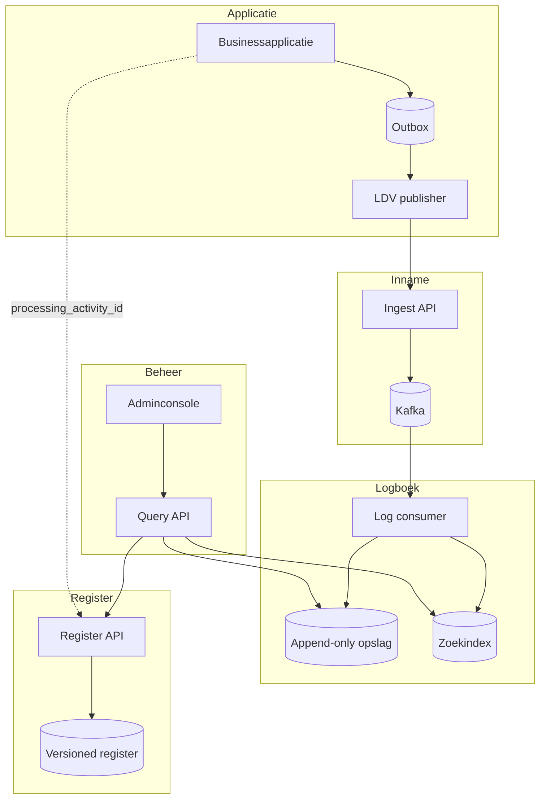

# Architectuuroverzicht

## Doel

Het platform ontkoppelt gemeentelijke applicaties van centrale LDV-opslag, zonder logregels te verliezen wanneer netwerk of centrale voorzieningen tijdelijk niet beschikbaar zijn. Het Register is zelfstandig beheerbaar en logregels zijn snel doorzoekbaar via een adminconsole.

## Componenten

| Component | Verantwoordelijkheid |
|---|---|
| Applicatie | Voert de dataverwerking uit en maakt trace-, span- en LDV-context |
| Transactionele outbox | Slaat businessmutatie en te publiceren event atomair op |
| LDV publisher | Leest de outbox en levert events herhaald aan tot ontvangst bevestigd is |
| Ingest API | Authenticeert bron, valideert envelop en accepteert events |
| Kafka | Duurzaam transport, piekbuffer, fan-out en replay |
| Log consumer | Valideert inhoud, dedupliceert en schrijft duurzaam |
| Append-only logopslag | Gezaghebbende opslag van geaccepteerde logregels |
| Zoekindex | Snelle, herbouwbare projectie voor onderzoek |
| Register API | Beheer en historische raadpleging van verwerkingsactiviteiten |
| Query API | Autorisatie en samengestelde queries over log, index en register |
| Adminconsole | Registerbeheer, traceonderzoek, export en operationeel inzicht |

## Componentdiagram

## Schrijf- en leespaden

Het schrijfpad is volledig asynchroon vanaf de lokale outbox. De applicatie is niet afhankelijk van Kafka, de zoekindex of het Register tijdens een gebruikersrequest.

De append-only opslag is de bron van waarheid. De zoekindex bevat een denormaliseerde projectie en mag volledig worden verwijderd en opnieuw worden opgebouwd. De Query API gebruikt de index voor zoeken en haalt zo nodig het originele record en de historisch geldige registerversie op.

## Scheiding van logstromen

LDV-logging, security-/auditlogging en telemetrie mogen infrastructuur delen, maar hebben eigen topics, schema's, autorisaties, opslag en retentie. Correlatie vindt plaats via `trace_id`, niet door gebruikersidentiteiten in LDV-logregels op te nemen.
